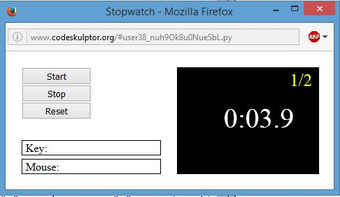

# Python minigames
## Description
Classic minigames developed in Python language using Codeskulptor framework:
- Stopwatch
- Pong
- Blackjack
- Ricerocks (Asteroids)

All these games are assignements corresponding to [An Introduction to Interactive Programming in Python](https://www.coursera.org/learn/interactive-python-1).

## Execute instructions
All files are saved in Codeskulptor server, to which you can access clicking on next links:
- [Stopwatch](http://www.codeskulptor.org/#user38_nuh9Ok8u0NueSbL.py)
- [Pong](http://www.codeskulptor.org/#user38_OGv13g6I21QFQ05.py)
- [Blackjack](http://www.codeskulptor.org/#user38_I8QsNnmOUnWcpPr.py)
- [Ricerocks](http://www.codeskulptor.org/#user38_XswOe2pa1UaRiIE.py)

Then, you only have to press the **play** button.

## Minigames instructions
### Stopwatch
You have to stop the chronometer when tenths of second were zero.
### Pong
Classic game for two players in the same keyboard. Left paddle is controlled with W and S keys, right paddle is controlled with Up and Down keys. The ball increase its speed with each rebound in the paddles. 
### Blackjack
Simple version of the popular casino game, where you play against the machine to get 21 points.
### Ricerocks
Modern version of the classic game Asteroids. You can move the spaceship using the key arrows and shoot pressing the Space key. As your score rises, the asteroids will increase their speed.

## Screenshots

